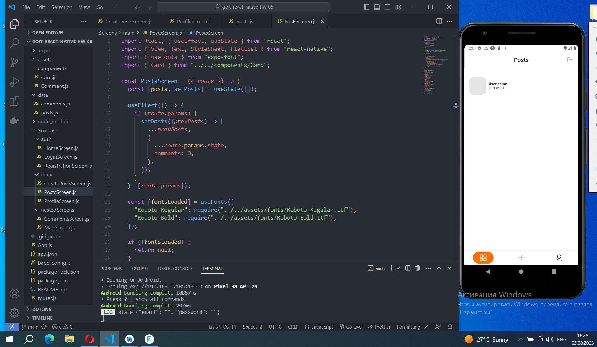
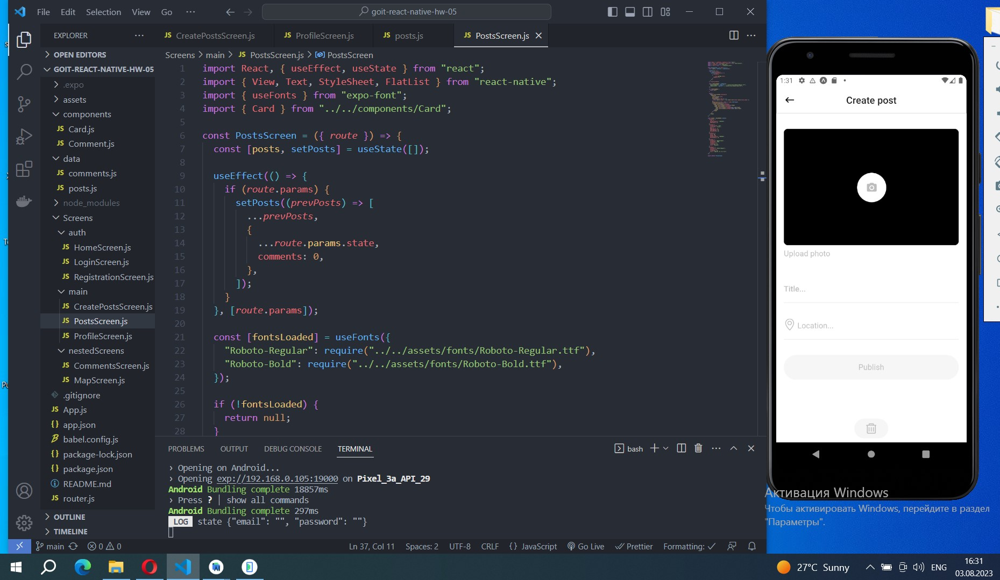
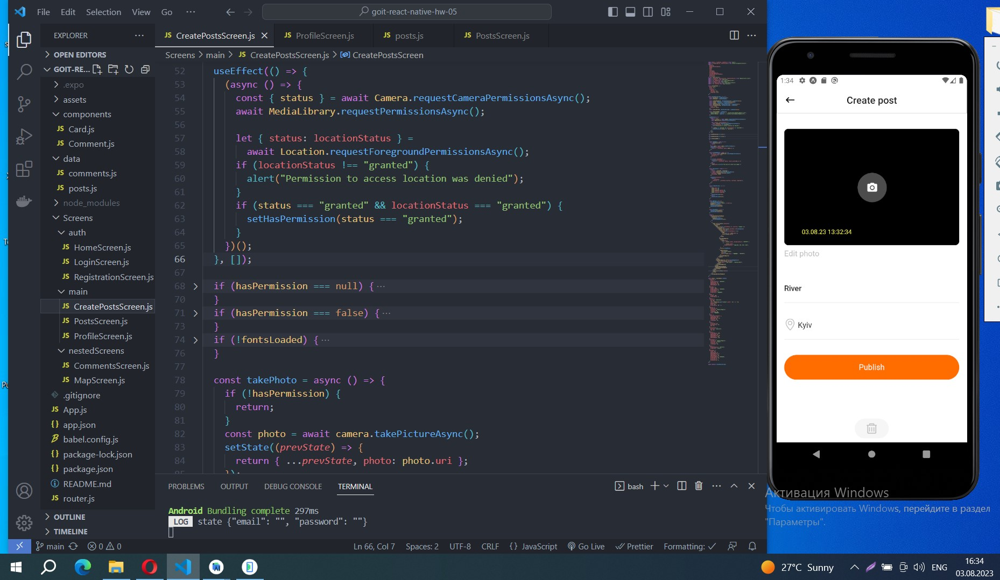
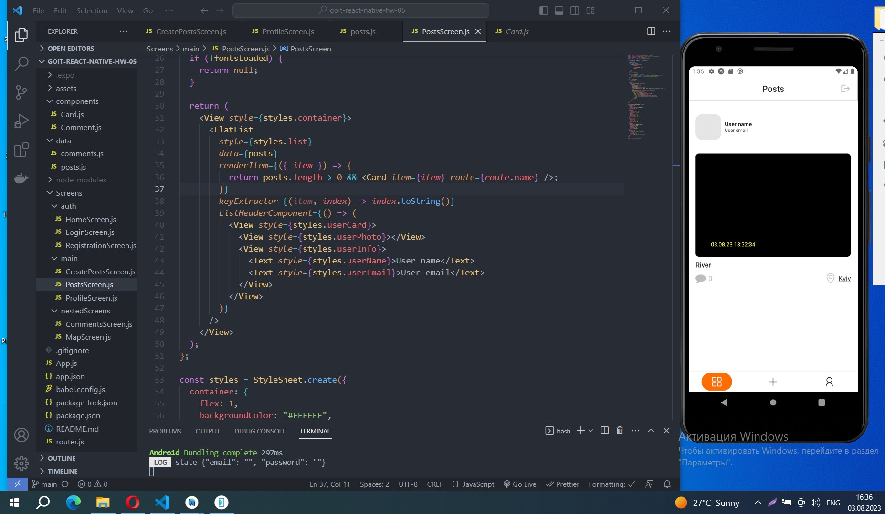
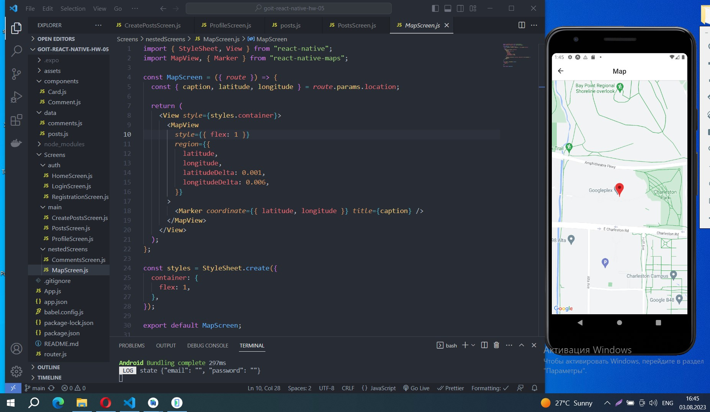

# Screenshots of project on Android emulator

## 1. Posts Screen without posts

## 2. CreatePostsScreen when the screen is open

## 3. CreatePostScreen with fields filled

## 4. PostScreen after publishing post

## 5. MapScreen with opened map

